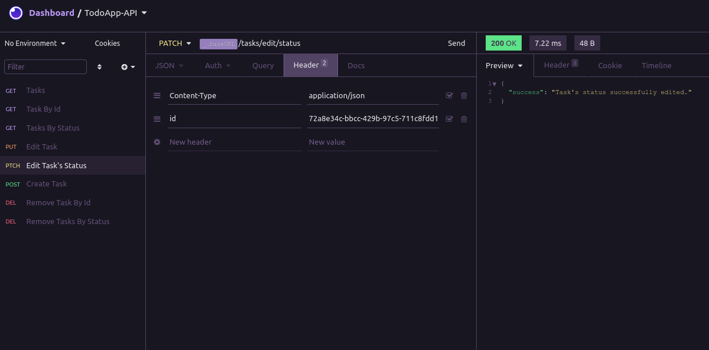

<h1 align="center">
  Criando uma API para servir o front-end da aplicação 
  <a href="https://github.com/viictorcamposs/todo-app">
    Todo App
  </a>.
</h1>

<p align="center">
  Desenvolvi esse projeto para praticar e fixar meus estudos sobre criação de APIs com Node.js,
  utilizando o padrão de arquitetura REST e TypeScript. 
  Todas as funcionalidades estão descritas, a seguir, nos requisitos da API e nas regras de negócio.
</p>

<p align="center">
  
  <a href="https://opensource.org/licenses/MIT">
    
  </a>
</p>

[//]: # (Add your gifs/images here:)
<p align="center">
  
</p>

<hr />

### Requisitos

- [x] Deve ser possível buscar todas as tarefas
- [x] Deve ser possível cadastrar uma tarefa
- [x] Deve ser possível buscar única tarefa
- [x] Deve ser possível editar tarefa
- [x] Deve ser possível marcar uma tarefa como 'pendente', 'em andamento' ou 'finalizada'
- [x] Deve ser possível buscar tarefas por status
- [x] Deve ser possível remover uma tarefa
- [x] Deve ser possível remover tarefas por status

### Regras de negócio

- [x] Não deve ser possível cadastrar uma tarefa com o mesmo título
- [x] Não deve ser possível editar uma tarefa que não existe
- [x] Não deve ser possível editar a descrição ou título de uma tarefa que está 'finalizada' ou 'em andamento'
- [x] Não deve ser possível buscar tarefas por um status inválido
- [x] Não deve ser possível remover uma tarefa que não existe
- [x] Não deve ser possível marcar duas tarefas como 'em andamento'

### Como utilizar:
Você precisa ter instalado na sua máquina o [Node.js](https://nodejs.org/en/) para poder rodar o projeto e um software para poder visualizar o resultado das requisições de acordo com url, como [Insomnia](https://insomnia.rest/), [Postman](https://www.postman.com/), etc.
   
#### Passos:

##### 1. Clone o repositório.

```
  $ git clone https://github.com/viictorcamposs/todo-app-api
```
##### 2. Abra o projeto no editor de sua preferência.

##### 3. No seu terminal, instale os pacotes necessários.

```
  $ yarn 
  ou 
  $ npm install
```

##### 4. Show de bola! Agora inicie o servidor

```
  $ yarn dev 
  ou 
  $ npm run dev
```
##### 5. Abra seu software para desenvolvimentos de APIs e é só começar a fazer as requisições de acordo com as rotas.
